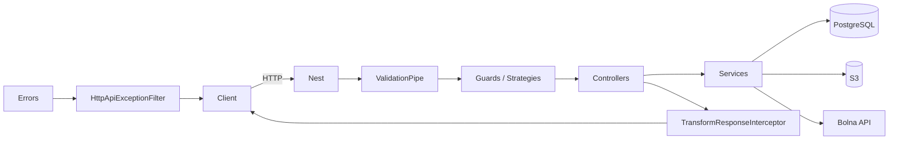
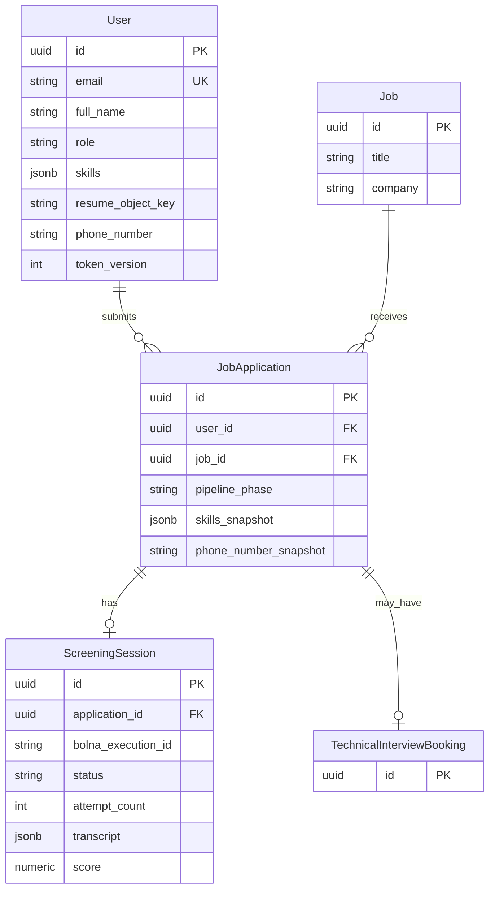

# Backend architecture (`apps/api`)

This document describes the **NestJS** service: how it boots, how code is organized into modules, how data is stored, which external systems it talks to, and how HTTP responses and security are structured.

---

## 1. Technology stack

| Layer | Choice | Notes |
|--------|--------|--------|
| Runtime | Node.js | TypeScript throughout. |
| Framework | NestJS 11 | Modules, DI, guards, pipes, filters, interceptors. |
| HTTP | Express (via `@nestjs/platform-express`) | Default Nest adapter. |
| ORM | TypeORM 0.3 | PostgreSQL; `autoLoadEntities: true`. |
| Database | PostgreSQL | Connection via `DATABASE_URL`. |
| Auth | Passport + JWT | Local strategy for login; JWT strategy for APIs; `tokenVersion` for invalidation. |
| Validation | `class-validator` + `class-transformer` | Global `ValidationPipe` (whitelist, transform, forbid non-whitelisted). |
| API docs | Swagger / OpenAPI | Served at `/api/docs` (see below). |
| File storage | AWS SDK S3 | Résumé and generic uploads; optional custom endpoint (e.g. MinIO). |
| Voice AI | Bolna | Outbound screening calls, webhooks, optional second agent for technical interview scheduling. |
| Optional LLM | Gemini / Anthropic / OpenAI | Pluggable transcript scoring via env (`SCREENING_LLM_*`). |

---

## 2. Process entry and global behavior

**Entry:** `src/main.ts`

- **Global prefix:** all routes are under `api` → base URL is `http://<host>:<port>/api`.
- **Global `ValidationPipe`:** request DTOs are validated; unknown properties are rejected (`forbidNonWhitelisted`).
- **Exception filter:** `HttpApiExceptionFilter` — maps all errors to a **unified JSON envelope** (see §7).
- **Interceptor:** `TransformResponseInterceptor` — wraps successful handler return values in the same envelope shape.
- **CORS:** `CORS_ORIGIN` (default `http://localhost:3000`); `credentials: true` for cookie-capable clients.
- **Swagger:** `DocumentBuilder` + `SwaggerModule.setup('docs', ...)` with `useGlobalPrefix: true` → UI at **`/api/docs`**.



---

## 3. Application module graph

**Root module:** `src/app.module.ts`

- **`ConfigModule.forRoot({ isGlobal: true })`**  
  Loads env files in order (first file wins per variable in Nest’s merge; the project lists paths so that more specific files can override—see `envFilePath` in `app.module.ts`):  
  `apps/api/.env.local` → `apps/api/.env` → monorepo root `.env`.

- **`TypeOrmModule.forRootAsync`**  
  Uses `createTypeOrmRootOptions(config)` from `src/database/typeorm-root-options.ts`:
  - `type: 'postgres'`
  - `url: DATABASE_URL` (required)
  - `autoLoadEntities: true`
  - **`synchronize: true`** — **development convenience**; auto-applies entity schema. For production, prefer migrations and turn `synchronize` off (code change required).

- **Feature modules** (import order in `app.module.ts` is not a runtime dependency order; cross-module dependencies are explicit in each module):

| Module | Path | Purpose |
|--------|------|--------|
| `UsersModule` | `modules/users` | `User` entity, user lookups, password handling coordination via services. |
| `AuthModule` | `modules/auth` | Register/login/logout/me/profile; JWT + local strategies; `RolesGuard`. |
| `JobsModule` | `modules/jobs` | Jobs CRUD for listing/apply; `JobApplication` and pipeline phase. |
| `AdminModule` | `modules/admin` | Admin-only job/application views, rescore, technical interview call triggers. |
| `SeedModule` | `database/seed` | `OnModuleInit` seeding of jobs if empty. |
| `UploadModule` | `modules/upload` | Authenticated S3 upload/delete/presign-style helpers. |
| `ScreeningModule` | `modules/screening` | Bolna client, screening sessions, webhooks, LLM scoring. |
| `InterviewSchedulingModule` | `modules/interview-scheduling` | Technical interview slots, booking, Bolna scheduling integration. |

**App-level controller:** `AppController` — e.g. `GET /api` (hello) and `GET /api/health` for reachability checks.

---

## 4. Domain model (persistence)

Entities live next to their feature; TypeORM **auto-loads** them when the feature registers `TypeOrmModule.forFeature([...])`.



**Pipeline:** `JobApplication.pipelinePhase` drives which actions are allowed (e.g. screening only while in `SCREENING`, rejection closes the application, later phases for interview). Exact enum values are in `modules/jobs/enums/`.

**Screening session:** One row per application (unique `application_id`). Stores Bolna execution id, status, attempt count, transcript, optional score, extracted JSON, and raw webhook payload for audit.

---

## 5. HTTP API surface (by controller prefix)

All paths below are **relative to** `/api` (global prefix).

| Prefix | Auth | Role | Main operations |
|--------|------|------|-----------------|
| *(root)* | — | — | `GET /` — intro; `GET /health` — liveness. |
| `auth` | Mixed | — | `POST /auth/register`, `POST /auth/login`, `POST /auth/logout`, `GET /auth/me`, `PATCH /auth/me/profile` (Bearer for protected). |
| `jobs` | Mixed | — | `GET /jobs` — list; `POST /jobs/:jobId/apply` — authenticated apply. |
| `job-applications` | JWT | user | `GET /job-applications/me` — my applications. |
| `uploads` | JWT | user | `POST /uploads/file` (multipart), `POST /uploads/read-url`, `POST /uploads/delete`. |
| `screening` | JWT / public | user / — | `GET /screening/sessions/by-application/:id`, `POST /screening/sessions` (start), `POST /screening/webhook` (**public** — Bolna). |
| `technical-interviews` | JWT | user | `GET .../state`, `POST .../confirm` for booking. |
| `admin` | JWT + role | `admin` | List jobs/applications, application detail, rescore screening, trigger technical interview call. |

**Authorization model:**

- **`JwtAuthGuard`** — validates JWT, attaches `SafeUser` to `req.user`.
- **`RolesGuard` + `@Roles('admin')`** — requires `user.role === 'admin'` (default role in guard is `user` if null).

---

## 6. Cross-cutting concerns

### 6.1 Auth and JWT

- **Local strategy:** email/password for `POST /auth/login`.
- **JWT strategy:** bearer token; payload includes a **token version** (`tv`) aligned with `User.tokenVersion` so the server can invalidate all sessions by incrementing the version.
- **Passwords:** stored as bcrypt hash; not selected by default on user queries.

### 6.2 Screening and Bolna

- **`BolnaClient`** — HTTP client to `BOLNA_API_BASE_URL` and `BOLNA_CALL_ENDPOINT`; used to start outbound calls with context (candidate name, job, etc.).
- **Webhook** — `POST /api/screening/webhook` accepts JSON from Bolna. The code comments state **requests are not signed**; production deployments should **allow-list** Bolna’s source IP (documented in `.env.example`) or terminate TLS at a trusted edge that enforces that policy.
- **Scoring:** Transcript can be scored via **optional** LLM providers (`SCREENING_LLM_PROVIDER`) or derived heuristics; pass/fail uses `SCREENING_PASS_THRESHOLD` and related rules in `ScreeningService`.
- **Retries:** `SCREENING_MAX_ATTEMPTS` and session status govern how many calls can be started.

### 6.3 Technical interview scheduling

- **`TechnicalInterviewSchedulingService`** — enforces that candidates **passed screening** (score ≥ threshold) before booking; reads available slots from `TECH_INTERVIEW_AVAILABLE_SLOTS_JSON` and related env; can use a **separate Bolna agent** for scheduling calls.
- **Slot source:** `TECH_INTERVIEW_SLOT_SOURCE` (`bolna_calendar_tools` | `env_static` | `hybrid`) documents how voice vs. web self-serve stay in sync (see comments in `.env.example`).

### 6.4 Uploads (S3)

- **Upload service** uses AWS SDK v3; bucket/region from env. Objects are stored with **public-read** ACL for résumé URLs (see `.env.example` for bucket policy notes).
- **Size / MIME** — enforced in `upload.constants` and the controller (memory storage for multipart).

### 6.5 Seeding

- **`SeedModule`** — registers `SeedService` which on `onModuleInit` calls `JobsSeeder.seedIfEmpty()`. Failures are logged; API still starts (so a bad DB does not block the process, but data may be missing until fixed).

---

## 7. API response envelope

Success and error responses follow one shape so the **Next.js** client can handle them uniformly.

**Success** (interceptor):

```json
{
  "success": true,
  "error": null,
  "data": { },
  "message": "Request successful"
}
```

**Error** (filter):

```json
{
  "success": false,
  "error": { "statusCode": 400, "message": "..." },
  "data": null,
  "message": "..."
}
```

Types are defined under `src/common/interfaces/api-response.interface.ts` (naming may vary; the structure is stable in `TransformResponseInterceptor` and `HttpApiExceptionFilter`).

---

## 8. Configuration reference

All variables are documented in **`apps/api/.env.example`**. Grouped roughly:

- **Server:** `PORT`, `CORS_ORIGIN`
- **Database:** `DATABASE_URL` (or discrete `DATABASE_*` if you construct URL elsewhere—URL is what TypeORM uses in code)
- **Auth:** `JWT_SECRET`, `JWT_EXPIRES_IN`
- **S3:** `AWS_REGION`, `S3_BUCKET`, keys, optional `S3_ENDPOINT`
- **Bolna:** `BOLNA_API_BASE_URL`, `BOLNA_CALL_ENDPOINT`, `BOLNA_API_KEY`, agent ids, webhook documentation
- **Screening policy:** `SCREENING_PASS_THRESHOLD`, `SCREENING_MAX_ATTEMPTS`, `SCREENING_LLM_*`, provider API keys
- **Technical interviews:** `TECH_INTERVIEW_AVAILABLE_SLOTS_JSON`, `TECH_INTERVIEW_SLOT_SOURCE`, optional `BOLNA_TECH_INTERVIEW_SCHEDULING_AGENT_ID`

---

## 9. Build and run

- **Development:** `pnpm dev` in `apps/api` → `nest start --watch`.
- **Production:** `nest build` → `node dist/main` (see `package.json` `start:prod`).  
- **API root path resolution:** `app.module.ts` resolves `apiRoot` and `monorepoRoot` from `__dirname` so config file paths are correct from both `src/` and compiled `dist/`.

---

## 10. Design principles in this codebase

- **Modular boundaries:** Each domain (auth, jobs, screening, etc.) owns its controllers, services, and entities; shared behavior lives in `common/` (filters, interceptors, utils, config helpers).
- **Thin controllers:** Controllers delegate to services; complex branching stays in services (e.g. `ScreeningService`).
- **Explicit wiring:** Nest modules declare imports/exports; cross-module use goes through exported providers.
- **Type safety:** DTOs and typed entities; validation at the edge.

For **frontend** architecture, see `apps/web` (Next.js App Router, Zustand auth store, etc.) — not duplicated here.

---

## 11. Future hardening (production checklist)

- Disable TypeORM **`synchronize`**; add migrations.
- Secrets via a managed store (not committed `.env`).
- Webhook authentication at network or application layer; rate limiting on public routes.
- Structured logging and correlation ids for Bolna execution ids.

This document reflects the repository as of the last update; when in doubt, prefer **source files** and **`apps/api/.env.example`** as the source of truth.
